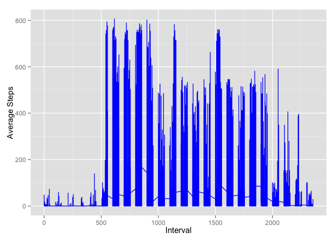

# Reproducible Research: Peer Assessment 1

- Loading and preprocessing the data

```r
x <- read.csv(unz("activity.zip", "activity.csv"))
library(ggplot2)
summary(x)
```

```
##      steps               date          interval   
##  Min.   :  0.0   2012-10-01:  288   Min.   :   0  
##  1st Qu.:  0.0   2012-10-02:  288   1st Qu.: 589  
##  Median :  0.0   2012-10-03:  288   Median :1178  
##  Mean   : 37.4   2012-10-04:  288   Mean   :1178  
##  3rd Qu.: 12.0   2012-10-05:  288   3rd Qu.:1766  
##  Max.   :806.0   2012-10-06:  288   Max.   :2355  
##  NA's   :2304    (Other)   :15840
```

##What is mean total number of steps taken per day?  


```r
#Calc total steps by date
ts_bydate <- aggregate(x$steps, list(x$date), sum, na.rm=TRUE)
names(ts_bydate) <- c("Date", "Steps")
qplot(ts_bydate$Date, ts_bydate$Steps)
```

 
 
*The mean number of steps taken per day is
9354 and the median number of steps taken per day is
10395.*

##What is the average daily activity pattern?


```r
#Calc average steps by interval
ts_byint <- aggregate(x$steps, list(x$interval), mean, na.rm=TRUE)
names(ts_byint) <- c("TimeInterval", "AvgSteps")
#Present histogram of average steps by interval
qplot(ts_byint$TimeInterval, ts_byint$AvgSteps)
```

 

- The chart above displays the average daily activity pattern across 5 minute intervals.

## Imputing missing values

The total number of rows with NAs: 2304


```r
x$intervalmean <- ts_byint$AvgSteps
x$imputedsteps <- x$steps
x$imputedsteps[is.na(x$imputedsteps)] <- x$intervalmean
```

```
## Warning: number of items to replace is not a multiple of replacement
## length
```

```r
imp_bydate <- aggregate(x$imputedsteps, list(x$date), sum, na.rm=TRUE)
names(imp_bydate) <- c("Date", "Steps")
```

*After missing value replacement, the mean number of steps taken per day is
10766 and the median number of steps taken per day is
10766.*


## Are there differences in activity patterns between weekdays and weekends?


```r
x$day <- weekdays(as.Date(x$date))
x$weekday <- ifelse(x$day == "Saturday", "Weekend", ifelse(x$day == "Sunday", "Weekend", "Weekday"))

weekend_data <- subset(x, weekday == "Weekend")
weekday_data <- subset(x, weekday == "Weekday")

ts_weekday <- aggregate(weekday_data$imputedsteps, list(weekday_data$interval), mean, na.rm=TRUE)
ts_weekend <- aggregate(weekend_data$imputedsteps, list(weekend_data$interval), mean, na.rm=TRUE)
names(ts_weekday) <- c("TimeInterval", "AvgSteps")
names(ts_weekend) <- c("TimeInterval", "AvgSteps")

ggplot(weekday_data, aes(interval, imputedsteps)) + geom_line(colour="blue") + xlab("Interval") + ylab("Average Steps")
```

 

```r
ggplot(weekend_data, aes(interval, imputedsteps)) + geom_line(colour="red") + xlab("Interval") + ylab("Average Steps")
```

 
